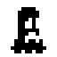
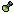

# pgzero-roguelike


<br/>

## Quick overview

This is a small semi turn based roguelike made with pgzero. Move with WASD / arrow keys, collect , avoid  and , and find the  to go to the next floor.

## How to run the game:

1. Make sure you have pgzero installed:

```pip install pgzero```

2. Run the game by typing:

```pgzrun main.py```

## Controls

* Move: WASD or ↑←↓→
* Drink potion (delay the enemy move): C
* Toggle music: from main or pause menu
* Pause: escape key

## Objective and gameplay

* Each floor is procedurally generated (rooms & corridors).
* Your goal: collect 2  on the floor and reach the staircase  to go deeper.
* Enemies  and traps  are scattered through rooms, try to avoid them!.
* Available steps are shown as  next to your health .
* When you make a step and you don't have any available steps anymore, the enemies make a step with you.
* Drinking a potion  consumes it and delays enemy turns by one step (useful in tight spots).

## The project requirements checklist:

- [x] Main menu with "play", "music ON/OFF", "exit"
- [x] Background music and sound effects
- [x] Enemies are present and move around the level
- [x] The player class has functions for moving and animations
- [x] The enemies and player are animated
- [x] The variables are named in english and are generally self explanatory
- [x] The game mechanics are simple to understand
- [x] The code and artwork were created by me